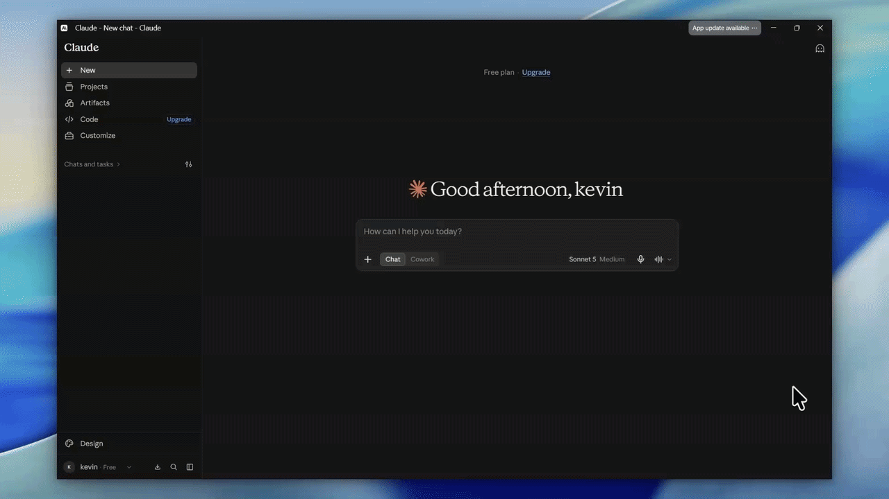
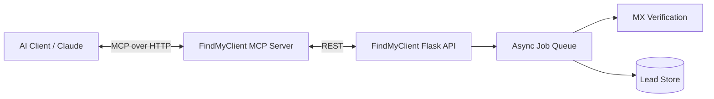

<div align="center">
<p>

</p>

[](https://modelcontextprotocol.io/)
[](#)
[](https://findmyclient.org)
[](#)

</div>

<br>

> [!IMPORTANT]
> The FindMyClient MCP is currently experimental and may change, break,
> or be updated without notice as we continue to improve it.
> **FindMyClient MCP** connects your AI assistant directly to [FindMyClient.org](https://findmyclient.org)
> Skip the API docs, skip the curl commands. Just ask Claude to find and verify a lead, and it does.

<br>

MCP server:
```
https://mcp.findmyclient.org/mcp
```

---

## ⚡ Why this exists

Manually hunting for verified business emails is a time sink. This server exposes FindMyClient's job-queue-based enrichment engine as native MCP tools, so any MCP-compatible client (Claude Desktop, Cursor, Windsurf, your own agent) can:

- Kick off async lead searches without babysitting a job queue
- Pull back MX-verified emails, not guesses
- Fold lead enrichment straight into an agentic outreach workflow

---

## 🧰 Available MCP Tools
 
*AI assistants read this section directly — keep it exact if you fork this.*
 
| Tool | Description | Parameters |
|---|---|---|
| `search_and_wait` | Runs a full FindMyClient search in one call: submits the job, polls until it completes (or fails/times out), and returns the enriched leads. The tool to use for a single "find me leads for X" request. | `api_token` [string, required], `query` [string, required], `max_pages` [int, optional], `max_websites` [int, optional], `max_results` [int, optional], `timeout_seconds` [int, default 10000] |
 
Internally, `search_and_wait` composes three FindMyClient API calls — job submission, status polling, and result retrieval — so the model only has to make one tool call instead of managing a poll loop itself.
 
> Get your token from your FindMyClient dashboard → API Tokens. Full reference: [docs.findmyclient.org/api-token](https://docs.findmyclient.org/api-token/)
 
---

## 🚀 Quick Start

### Prerequisites
- An MCP-compatible client (Claude Desktop, Claude Code, Cursor, Windsurf, etc.)
- A FindMyClient API key — [grab one here](https://findmyclient.org)

### 📺 Setup in 30 seconds

<p align="center">

</p>

### 1. Connect via hosted endpoint (recommended)

No install required — FindMyClient MCP is hosted. Just point your client at the URL:

```
https://mcp.findmyclient.org/mcp
```

#### Claude Desktop / Claude.ai
Settings → Connectors → Add custom connector → paste the URL above → authenticate with your API key.

#### Cursor / Windsurf
**Settings → Features → MCP → + Add New MCP Server**
- **Name:** `findmyclient`
- **Type:** `http`
- **URL:** `https://mcp.findmyclient.org/mcp`

### 2. Self-hosted / local (optional)

```bash
git clone https://github.com/Rottie420/findmyclient-mcp
cd findmyclient-mcp
pip install -r requirements.txt
```

`claude_desktop_config.json`:

```json
{
  "mcpServers": {
    "findmyclient": {
      "command": "python",
      "args": ["-m", "src.server"],
      "env": {
        "FINDMYCLIENT_API_KEY": "your_api_key_here"
      }
    }
  }
}
```

---

## 🛠️ Development & Debugging

### Run locally

```bash
python -m src.server
```

### Inspect with the MCP Inspector

```bash
npx -y @modelcontextprotocol/inspector python -m src.server
```

Use the Inspector to fire `search_leads` → `get_job_status` → `get_leads` manually and confirm the job-queue lifecycle resolves before wiring it into a client.

---

## 🏗️ Architecture



- **Tools** — the four functions above, mapped 1:1 to FindMyClient's `/search`, `/status`, `/leads`, and `/verify` endpoints
- **Job queue** — searches run async server-side; poll `get_job_status` until `complete` before calling `get_leads`
- **Verification layer** — every returned lead is MX-checked before it reaches the model, so agents aren't emailing dead addresses


---

## 📄 License
MIT
