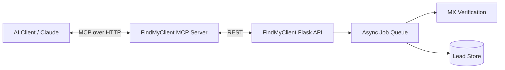

<div align="center">
<p>

</p>

 Give your AI agent a lead-gen brain — email discovery, verification, and enrichment for solo founders, straight from the model context.

[](https://modelcontextprotocol.io/)
[](#)
[](https://findmyclient.org)
[](#)

</div>
**FindMyClient MCP** connects your AI assistant directly to [FindMyClient.org](https://findmyclient.org) — a micro-SaaS lead enrichment API purpose-built for solo founders and freelancers. Skip the API docs, skip the curl commands. Just ask Claude to find and verify a lead, and it does.

```
https://mcp.findmyclient.org/mcp
```

---

## ⚡ Why this exists

Manually hunting for verified business emails is a time sink. This server exposes FindMyClient's job-queue-based enrichment engine as native MCP tools, so any MCP-compatible client (Claude Desktop, Cursor, Windsurf, your own agent) can:

- Kick off async lead searches without babysitting a job queue
- Pull back MX-verified emails, not guesses
- Fold lead enrichment straight into an agentic outreach workflow

---

## 🧰 Available MCP Tools

*AI assistants read this section directly — keep it exact if you fork this.*

| Tool | Description | Parameters |
|---|---|---|
| `search_leads` | Submits an async lead-search job against a query (industry, role, location) and returns a job ID. | `query` [string], `location` [string, optional], `limit` [integer, optional] |
| `get_job_status` | Polls a running search job for completion state. | `job_id` [string] |
| `get_leads` | Retrieves the finished `LeadsResult` — enriched, MX-verified rows — for a completed job. | `job_id` [string] |
| `verify_email` | Runs MX/deliverability verification on a single email address. | `email` [string] |

> Update this table to match your live tool schema — MCP clients parse these descriptions to decide *when* to call each tool, so precision here directly drives model behavior.

---

## 🚀 Quick Start

### Prerequisites
- An MCP-compatible client (Claude Desktop, Claude Code, Cursor, Windsurf, etc.)
- A FindMyClient API key — [grab one here](https://findmyclient.org)

### 1. Connect via hosted endpoint (recommended)

No install required — FindMyClient MCP is hosted. Just point your client at the URL:

```
https://mcp.findmyclient.org/mcp
```

#### Claude Desktop / Claude.ai
Settings → Connectors → Add custom connector → paste the URL above → authenticate with your API key.

#### Cursor / Windsurf
**Settings → Features → MCP → + Add New MCP Server**
- **Name:** `findmyclient`
- **Type:** `http`
- **URL:** `https://mcp.findmyclient.org/mcp`

### 2. Self-hosted / local (optional)

```bash
git clone https://github.com/Rottie420/findmyclient-mcp
cd findmyclient-mcp
pip install -r requirements.txt
```

`claude_desktop_config.json`:

```json
{
  "mcpServers": {
    "findmyclient": {
      "command": "python",
      "args": ["-m", "src.server"],
      "env": {
        "FINDMYCLIENT_API_KEY": "your_api_key_here"
      }
    }
  }
}
```

---

## 🛠️ Development & Debugging

### Run locally

```bash
python -m src.server
```

### Inspect with the MCP Inspector

```bash
npx -y @modelcontextprotocol/inspector python -m src.server
```

Use the Inspector to fire `search_leads` → `get_job_status` → `get_leads` manually and confirm the job-queue lifecycle resolves before wiring it into a client.

---

## 🏗️ Architecture



- **Tools** — the four functions above, mapped 1:1 to FindMyClient's `/search`, `/status`, `/leads`, and `/verify` endpoints
- **Job queue** — searches run async server-side; poll `get_job_status` until `complete` before calling `get_leads`
- **Verification layer** — every returned lead is MX-checked before it reaches the model, so agents aren't emailing dead addresses

---

## 📄 License
MIT